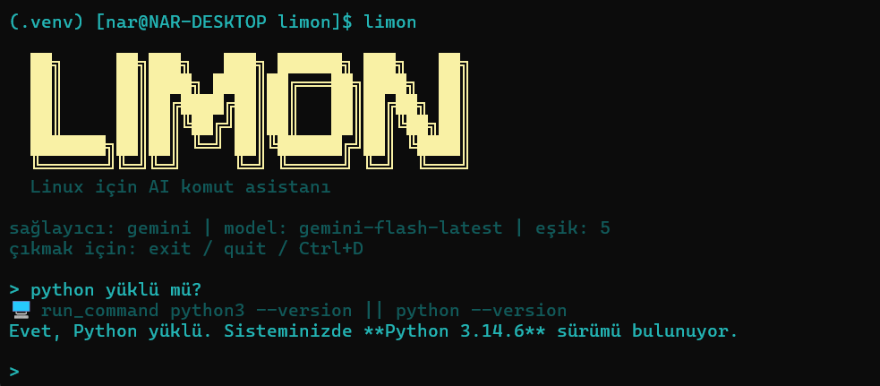

# 🍋 limon

**Terminalde çalışan, çoklu AI sağlayıcılı komut satırı asistanı.**
Dosya okur/yazar, komut çalıştırır; riskli işlemlerden önce sana sorar.


Sağlayıcılar: **ChatGPT (OpenAI)** · **Gemini (Google)** · **Claude (Anthropic)** · **Ollama (yerel)**



## Kurulum

Python 3.9 veya üstü gerekir.

**Linux / macOS** (tek komut, git gerekmez)

```bash
curl -fsSL https://aardaakpinar.github.io/limon/install.sh | bash
```

**Windows (PowerShell)**

```powershell
irm https://aardaakpinar.github.io/limon/install.ps1 | iex
```

Bu komutlar kodları `~/.limon/src` (Windows: `%USERPROFILE%\.limon\src`) altına indirir ve kurar. Aynı komutu tekrar çalıştırmak limon'u günceller.

Sağlayıcı seçmek için: `curl -fsSL https://aardaakpinar.github.io/limon/install.sh | bash -s -- --extras claude`
veya Windows'ta `$env:LIMON_EXTRAS = "claude"; irm https://aardaakpinar.github.io/limon/install.ps1 | iex`.

<details>
<summary>Elle kurulum (git ile)</summary>

```bash
git clone https://github.com/aardaakpinar/limon.git
cd limon
bash install.sh                                            # Linux/macOS
powershell -ExecutionPolicy Bypass -File .\install.ps1     # Windows
```

</details>

Betik kurulumu bir sanal ortamda (`.venv`, tek komut kurulumunda `~/.limon/venv`) yapar ama `limon` komutunu ortamın dışına da ekler. Yani **ortamı etkinleştirmene gerek yok**, `limon` her terminalden çalışır.

- Linux/macOS: komut `~/.local/bin` altına eklenir. Bu klasör PATH'te değilse betik ne yapman gerektiğini söyler.
- Windows: kurulumdan sonra yeni bir terminal aç.
- Kaynak klasörünü (`~/.limon/src` veya klonladığın klasör) silme veya taşıma; kurulum ona bağlıdır.

Yalnızca bir sağlayıcı kurmak için: `bash install.sh --extras claude` (`openai`, `gemini` veya `all`). Windows'ta: `.\install.ps1 -Extras claude`.

PyPI'ye yayınlandıktan sonra: `pipx install "limon[all]"` (veya `pip install "limon[all]"`).
Kaynaktan: `pipx install ".[all]"`.

Tek komutlu kurulum, GitHub'daki **son yayınlanmış sürümü** kurar (henüz yayın yoksa `main`). Belirli bir sürüm veya dal için `LIMON_REF=v0.2.0` ortam değişkenini ver.

## Kullanım

```bash
limon config                        # sağlayıcı, model, API anahtarı, onay eşiği
limon                               # etkileşimli mod
limon -p "bugünkü tarih nedir?"     # tek seferlik komut
limon models                        # sağlayıcının güncel model listesini göster
limon update                        # son sürüme güncelle (--check: yalnızca denetle)
limon --version
limon uninstall                     # ayarları sil
```

İlk çalıştırmada kurulum sihirbazı kendiliğinden açılır. Sağlayıcıyı seçtiğinde sihirbaz o sağlayıcının varsayılan modelini önerir; başka bir model için adını yazman yeterli. Model sorusunda `?` yazarsan (API anahtarı girilmişse) sağlayıcının canlı model listesi gösterilir; varsayılan adlar zamanla eskidiği için güncel adı `limon models` ile kontrol et.

Etkileşimli modda: `/config` ayarları açar, `/reset` konuşmayı sıfırlar, `exit` veya `Ctrl+D` çıkar.

| Sağlayıcı | Varsayılan model      | API anahtarı        |
| --------- | --------------------- | ------------------- |
| `openai`  | `gpt-4.1`             | `OPENAI_API_KEY`    |
| `gemini`  | `gemini-flash-latest` | `GEMINI_API_KEY`    |
| `claude`  | `claude-sonnet-5-5`   | `ANTHROPIC_API_KEY` |
| `ollama`  | `llama3.1`            | gerekmez            |

Ayarlar `~/.config/limon/config.json` dosyasında saklanır (Windows: `%USERPROFILE%\.config\limon\config.json`).

**Ollama:** `ollama serve` çalışıyor olmalı ve tool-calling destekleyen bir model çekilmiş olmalı (`llama3.1`, `qwen2.5`, `mistral-nemo` vb.):

```bash
ollama pull llama3.1
limon config    # sağlayıcı: ollama
```

## Nasıl çalışır?

1. Bir istek yazarsın. Model gerekirse bir araç çağırır:

   | Araç | Ne yapar |
   | --- | --- |
   | `read_file` | Dosyayı okur (`start_line`/`end_line` ile satır aralığı) |
   | `edit_file` | Dosyada birebir eşleşen metni değiştirir (yedek alır) |
   | `write_file` | Yeni dosya yazar / baştan yazar (yedek alır) |
   | `delete_file` | Dosyayı siler (yedek alır) |
   | `list_dir`, `glob` | Dizin listeler, desene göre dosya bulur (`**/*.py`) |
   | `grep` | Dosya içeriğinde regex arar (`.git`, `.venv`, `.env` vb. atlanır) |
   | `web_fetch` | Web sayfasını okunabilir metne çevirir |
   | `run_command` | Kabukta komut çalıştırır (zaman aşımı en fazla 10 dk) |
   | `get_current_datetime` | Tarih/saat |
2. limon her çağrıya [`danger.py`](limon/danger.py) içindeki kurallara göre **0–10 arası bir tehlike skoru** verir (`rm -rf`, `sudo`, `dd`, `curl | bash`, sistem dizinleri vb.).
3. Skor eşiğe ulaşırsa (varsayılan **5**) senden onay ister; ulaşmazsa işlem doğrudan çalışır. Hassas dosyaları okumak (`~/.ssh`, `.env`, limon'un kendi `config.json`'u, `*.pem`...) ve yerel/özel ağ adreslerine `web_fetch` yapmak da onay gerektirir.
4. Üzerine yazılan veya silinen dosyaların yedeği `.limon_backups/` klasörüne alınır.

## Proje talimatları (`LIMON.md`)

Çalıştığın klasöre (veya bir üst klasörüne) `LIMON.md` koyarsan içeriği her oturumda modele proje notu olarak verilir. Örnek:

```markdown
Testleri `pytest -q` ile çalıştır. Commit mesajlarını Türkçe yaz. `legacy/` klasörüne dokunma.
```

## Özelleştirme

- **Tehlike kuralları:** `limon/danger.py`
- **Yeni araç:** `limon/tools.py` içindeki `TOOL_DEFINITIONS` listesine tanımı, `TOOL_IMPLEMENTATIONS` sözlüğüne fonksiyonu ekle. Tüm sağlayıcılar bunu otomatik kullanır.
- **Yeni sağlayıcı:** `limon/providers/base.py` arayüzünü uygulayan bir dosya ekle.

## Güvenlik

- `run_command` doğrudan kabukta çalışır. Skorlama regex tabanlıdır ve kusursuz değildir; kritik sistemlerde eşiği düşük tut.
- API anahtarların yalnızca yerel config dosyasında durur ve sadece seçtiğin sağlayıcıya gönderilir.
- Yazılım "olduğu gibi" sunulur; önemli sistemlerde kullanmadan önce `danger.py` kurallarını gözden geçir.

## Sürüm yayınlama

1. `limon/__init__.py` içindeki `__version__` değerini artır ve commit'le.
2. `git tag v0.2.0 && git push --tags`

[`release.yml`](.github/workflows/release.yml) etiketle `__version__`'ın eşleştiğini denetler, testleri çalıştırır, paketi derler, PyPI'ye yükler ve GitHub sürümü oluşturur. Kurulum betikleri ve `limon update` "son sürüm" olarak bu GitHub sürümüne bakar.
PyPI için tek seferlik hazırlık: pypi.org'da `limon` adının boş olduğunu doğrula ve projeyi "trusted publisher" olarak bu depoya/`release.yml` iş akışına bağla (`pypi` ortamı).

Testler: `pip install -e ".[dev]" && pytest`.

## Katkıda bulunma

Fork'la, bir dal aç (`git checkout -b ozellik/yeni-arac`), değişikliğini yap ve pull request gönder. Hata bildirimleri ve öneriler için Issues sekmesini kullanabilirsin.

## Lisans

[GPL-3.0](LICENSE)
